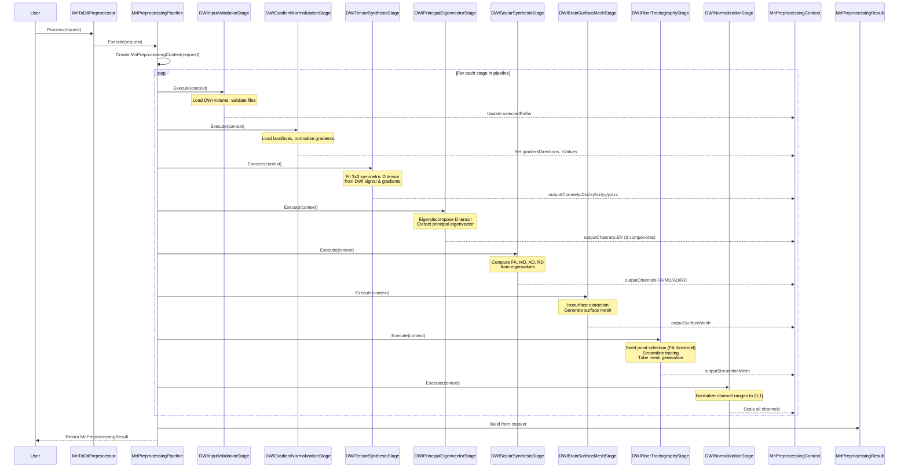

# DTI Preprocessor Pipeline - Class Diagram

## Architecture Overview

```mermaid
classDiagram
    %% Main Preprocessor
    class MriToDtiPreprocessor {
        -pipeline: MriPreprocessingPipeline
        +MriToDtiPreprocessor()
        +Process(request: MriPreprocessingRequest) MriPreprocessingResult
    }

    %% Pipeline
    class MriPreprocessingPipeline {
        -stages: vector~unique_ptr~IMriPreprocessingStage~~
        +AddStage(stage: unique_ptr~IMriPreprocessingStage~) MriPreprocessingPipeline&
        +Execute(request: MriPreprocessingRequest) MriPreprocessingResult
    }

    %% Stage Interface
    class IMriPreprocessingStage {
        <<interface>>
        +Name()* const char*
        +Execute(context: MriPreprocessingContext&)*
    }

    %% Concrete Stages
    class DWIInputValidationStage {
        +Name() const char*
        +Execute(context: MriPreprocessingContext&)
    }

    class DWIGradientNormalizationStage {
        +Name() const char*
        +Execute(context: MriPreprocessingContext&)
    }

    class DWITensorSynthesisStage {
        -BuildDesignRow(b: float, g: glm::vec3)$ array~float,6~
        -SolveSymmetricSystem6x6(...)$ array~float,6~
        -EstimateTensorFromSignal(signal, bValues, gradients) array~float,6~
        +Name() const char*
        +Execute(context: MriPreprocessingContext&)
    }

    class DWIPrincipalEigenvectorStage {
        +Name() const char*
        +Execute(context: MriPreprocessingContext&)
    }

    class DWIScalarSynthesisStage {
        +Name() const char*
        +Execute(context: MriPreprocessingContext&)
    }

    class DWIBrainSurfaceMeshStage {
        +Name() const char*
        +Execute(context: MriPreprocessingContext&)
    }

    class DWIFiberTractographyStage {
        -TractographySettings
        -SelectSeedPoints(...)$ vector~glm::vec3~
        -TraceStreamlineFromSeed(...)$ vector~glm::vec3~
        -SamplePrincipalDirection(...)$ glm::vec3
        -SampleTrilinearDirection(...)$ glm::vec3
        -BuildStreamlineMesh(...)$ shared_ptr~Mesh~
        +Name() const char*
        +Execute(context: MriPreprocessingContext&)
    }

    class DWINormalizationStage {
        +Name() const char*
        +Execute(context: MriPreprocessingContext&)
    }

    %% DTOs and Context
    class MriPreprocessingRequest {
        +dwiVolumePath: string
        +bvalPath: string
        +bvecPath: string
        +tractographySettings: shared_ptr~MriTractographySettings~
    }

    class MriPreprocessingContext {
        +request: MriPreprocessingRequest
        +report: MriPreprocessingReport
        +selectedDwiVolumePath: string
        +selectedBvalPath: string
        +selectedBvecPath: string
        +bValues: vector~float~
        +gradientDirections: vector~glm::vec3~
        +gradientMetadataValid: bool
        +outputChannels: DTIVolumeChannels
        +outputSurfaceMesh: shared_ptr~Mesh~
        +outputStreamlineMesh: shared_ptr~Mesh~
        +MriPreprocessingContext(request: MriPreprocessingRequest)
    }

    class MriPreprocessingResult {
        +channels: DTIVolumeChannels
        +surfaceMesh: shared_ptr~Mesh~
        +streamlineMesh: shared_ptr~Mesh~
        +report: MriPreprocessingReport
    }

    class MriPreprocessingReport {
        +sourceVolumePath: string
        +executedStages: vector~string~
        +warnings: vector~string~
    }

    class MriTractographySettings {
        -faSeedThresholdValue: float
        -faStopThresholdValue: float
        -l1StopThresholdValue: float
        -stepSizeVoxelsValue: float
        -maxStepsPerStreamlineValue: int
        -seedStrideValue: int
        -maxSeedsValue: size_t
        -minPointsPerStreamlineValue: size_t
        -tubeRadiusValue: float
        -tubeRadialSegmentsValue: unsigned int
        +GetFaSeedThreshold() float
        +GetFaStopThreshold() float
        +GetL1StopThreshold() float
        +GetStepSizeVoxels() float
        +GetMaxStepsPerStreamline() int
        +GetSeedStride() int
        +GetMaxSeeds() size_t
        +GetMinPointsPerStreamline() size_t
        +GetTubeRadius() float
        +GetTubeRadialSegments() unsigned int
        +SetFaSeedThreshold(value: float)
        +SetFaStopThreshold(value: float)
        +SetL1StopThreshold(value: float)
        +SetStepSizeVoxels(value: float)
        +SetMaxStepsPerStreamline(value: int)
        +SetSeedStride(value: int)
        +SetMaxSeeds(value: size_t)
        +SetMinPointsPerStreamline(value: size_t)
        +SetTubeRadius(value: float)
        +SetTubeRadialSegments(value: unsigned int)
        +GetInspectDisplayName() string
        +GetInspectFields() vector~shared_ptr~IInspectWidget~~
    }

    class MriPreprocessingRunner {
        +MriPreprocessingRunner()
        +Run(request: MriPreprocessingRunnerRequest) MriPreprocessingRunnerResult
        +BuildSummary(result: MriPreprocessingRunnerResult)$ string
    }

    class MriPreprocessingRunnerRequest {
        +preprocessingRequest: MriPreprocessingRequest
        +outputDirectory: string
        +outputBasename: string
    }

    class MriPreprocessingRunnerResult {
        +success: bool
        +message: string
        +preprocessingResult: MriPreprocessingResult
        +writtenFiles: vector~string~
    }

    class InspectProvider {
        <<interface>>
        +GetInspectDisplayName()* string
        +GetInspectFields()* vector~shared_ptr~IInspectWidget~~
    }

    %% Relationships
    MriToDtiPreprocessor --> MriPreprocessingPipeline : owns
    MriPreprocessingPipeline --> IMriPreprocessingStage : stores stages
    
    IMriPreprocessingStage <|-- DWIInputValidationStage
    IMriPreprocessingStage <|-- DWIGradientNormalizationStage
    IMriPreprocessingStage <|-- DWITensorSynthesisStage
    IMriPreprocessingStage <|-- DWIPrincipalEigenvectorStage
    IMriPreprocessingStage <|-- DWIScalarSynthesisStage
    IMariPreprocessingStage <|-- DWIBrainSurfaceMeshStage
    IMariPreprocessingStage <|-- DWIFiberTractographyStage
    IMariPreprocessingStage <|-- DWINormalizationStage

    MriPreprocessingPipeline --> MriPreprocessingContext : passes to stages
    MriPreprocessingPipeline --> MriPreprocessingResult : returns
    
    MriPreprocessingContext --> MriPreprocessingRequest : contains
    MriPreprocessingContext --> DTIVolumeChannels : accumulates
    MriPreprocessingContext --> MriPreprocessingReport : tracks

    MriPreprocessingResult --> DTIVolumeChannels : outputs
    MriPreprocessingResult --> MriPreprocessingReport : reports

    MriPreprocessingRequest --> MriTractographySettings : references

    MriPreprocessingRunner --> MriToDtiPreprocessor : uses
    MriPreprocessingRunner --> MriPreprocessingRunnerRequest : takes
    MriPreprocessingRunner --> MriPreprocessingRunnerResult : returns

    DWIFiberTractographyStage --> MriTractographySettings : reads settings
    
    MriTractographySettings --|> InspectProvider : implements
```



---

## Pipeline Execution Flow



---

## Stage Responsibilities

### 1. **DWIInputValidationStage**
- **Purpose**: Validate input files exist and are readable
- **Input**: MriPreprocessingRequest paths
- **Output**: selectedDwiVolumePath, selectedBvalPath, selectedBvecPath in context

### 2. **DWIGradientNormalizationStage**
- **Purpose**: Load gradient directions and b-values from files
- **Input**: Selected bval and bvec files
- **Output**: bValues, gradientDirections, gradientMetadataValid in context

### 3. **DWITensorSynthesisStage**
- **Purpose**: Fit diffusion tensor (3×3 symmetric matrix) to DWI signal
- **Method**: Least-squares regression with design matrix
- **Output**: DTI tensor components (Dxx, Dyy, Dzz, Dxy, Dxz, Dyz)

### 4. **DWIPrincipalEigenvectorStage**
- **Purpose**: Eigendecompose D tensor and extract principal eigenvector
- **Output**: Principal eigenvector (EVx, EVy, EVz) and eigenvalues (L1, L2, L3)

### 5. **DWIScalarSynthesisStage**
- **Purpose**: Compute derived scalar metrics
- **Metrics**: FA (Fractional Anisotropy), MD (Mean Diffusivity), AD (Axial Diffusivity), RD (Radial Diffusivity)
- **Output**: DTI scalar channels

### 6. **DWIBrainSurfaceMeshStage**
- **Purpose**: Generate brain surface mesh via isosurface extraction
- **Input**: Computed DTI scalar volumes (e.g., FA)
- **Output**: Surface mesh for visualization

### 7. **DWIFiberTractographyStage**
- **Purpose**: Deterministic fiber tracking via streamline propagation
- **Algorithm**:
  1. Select seed points where FA > threshold (e.g., 0.4)
  2. From each seed, trace streamline following principal eigenvector
  3. Stop when FA < threshold or max steps reached
  4. Generate tube geometry around streamlines
- **Settings**: Uses MriTractographySettings for thresholds, step size, seed parameters
- **Output**: Streamline mesh with tube geometry

### 8. **DWINormalizationStage**
- **Purpose**: Normalize all output channels to [0, 1] range
- **Output**: Normalized DTI channels ready for visualization

---

## Key Data Structures

### DTIVolumeChannels
Container for all DTI-derived volumes (tensor components, scalars, eigenvectors)

### MriPreprocessingContext
- **Role**: Carries state through the pipeline
- **Flows from**: Request → validated paths → gradient metadata → tensor components → scalars → final mesh outputs
- **Updated by**: Each stage sequentially

### MriTractographySettings
Configuration for fiber tractography:
- **Seed threshold**: FA > 0.4 (where to start tracing)
- **Stop threshold**: FA < 0.3 (where to stop)
- **Step size**: 0.3 voxels per step
- **Max steps**: 250 per streamline
- **Tube geometry**: 3 radial segments, 0.001 radius

### MriPreprocessingRunner
Wrapper that:
1. Constructs MriToDtiPreprocessor (which assembles pipeline)
2. Executes preprocessing
3. Writes results to disk (surfaces, scalars, etc.)
4. Returns success/failure + file paths written

---

## Extension Points

To add a new preprocessing stage:
1. Create class implementing `IMriPreprocessingStage`
2. Implement `Name()` and `Execute(MriPreprocessingContext&)`
3. Create factory function `CreateDwiXxxStage()`
4. Call `AddStage()` in `MriToDtiPreprocessor` constructor

Example:
```cpp
class DWIMyCustomStage final : public IMriPreprocessingStage {
  const char* Name() const override { return "My Custom Stage"; }
  void Execute(MriPreprocessingContext& context) const override {
    // read from context, compute, update context
  }
};
```
