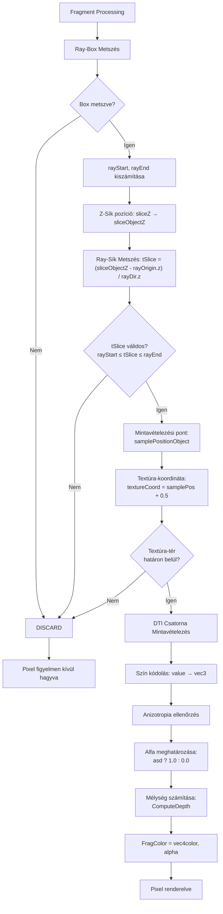

# DTI Téfogat Shader - Rövid Összefoglaló

## Fájl
`shaders/dti_fragment_shaders/volume_dti_tensor_fragment.glsl`

## Célkitűzés
Ez a fragment shader a **DTI (Diffusion Tensor Imaging) térfogati adatok vizualizálásához** szükséges. Lehetővé teszi egy 3D volument egyetlen 2D síkon (Z slice) végigvonva megjeleníteni, ezáltal részletesen vizsgálhatóvá téve a neurális szövet diffúziós tulajdonságait.

---

## Z Slicing Volume Render Működése

### Koncepció
A shader **egy adott Z mélységi síknál metszi el a 3D térfogatot**, és csak az erre a síkra eső adatokat rendereli le. Ez lehetővé teszi a felhasználó számára, hogy a térfogat belsejét szeletelve vizsgálja meg.

### Működési Lépések

```
┌─────────────────────────────────────────────────────────────┐
│                    Z SLICING FOLYAMAT                       │
├─────────────────────────────────────────────────────────────┤
│                                                               │
│  1. RAY-BOX METSZÉS                                           │
│     Egy pixel nézővonalát (ray) a térfogat dobozzal          │
│     metszük: tMin és tMax távolságok határozzák meg,         │
│     milyen hosszú szegmens metszi a térfogatot.             │
│                                                               │
│  2. Z-SÍK POZÍCIÓ MEGHATÁROZÁSA                              │
│     sliceZ uniform [0, 1] tartományból egy konkrét            │
│     Z mélységi síkot jelöl ki az objektum-térben             │
│     (-0.5 és 0.5 közötti értékek).                            │
│                                                               │
│  3. RAY-SÍK METSZÉS                                           │
│     Meghatározzuk, hogy az adott nézővonal hol              │
│     metszi a kiválasztott Z síkot (tSlice paraméter).       │
│     Ha ez a pont a ray-box szegmensen kívül van,            │
│     pixel discard → nincs renderelés.                        │
│                                                               │
│  4. TEXTÚRA MINTAVÉTELEZÉS                                   │
│     Az adott síkon keresztüli pont koordinátáit             │
│     (samplePositionObject) átkonvertáljuk textúra-           │
│     koordinátára [0, 1] tartományba.                         │
│                                                               │
│  5. DTI CSATORNA KIVÁLASZTÁS ÉS MEGJELENÍTÉS                │
│     Az adott pozícióban mintavételezzük a kiválasztott      │
│     DTI csatornát (FA, MD, eigenvalues stb.),               │
│     és megjelenítjük a hozzá tartozó szín-kódolással.       │
│                                                               │
└─────────────────────────────────────────────────────────────┘
```

### Matematikai Magveto

#### Ray-Box Metszés (IntersectBox)
```glsl
vec3 rayOriginObject      // Kamera pozíciója objektum-térben
vec3 rayDirectionObject   // Nézővonal iránya
float tMin, tMax          // Metszéspontok távolságai
```

Az AABB (Axis-Aligned Bounding Box) az origó körüli [-0.5, 0.5] kocka.
A shader kiszámítja, hogy a nézővonal hol lép be és hol lép ki a dobozból.

#### Z-Sík és Ray Metszés (Kritikus!)
```glsl
float sliceObjectZ = clamp(shader.sliceZ, 0.0, 1.0) - 0.5;
// sliceZ: 0.5 → sliceObjectZ = 0.0   (középső sík)
// sliceZ: 1.0 → sliceObjectZ = 0.5   (felső sík)
// sliceZ: 0.0 → sliceObjectZ = -0.5  (alsó sík)

float tSlice = (sliceObjectZ - rayOriginObject.z) / rayDirectionObject.z;
//            = távolság a nézővonal origójától a Z-sík metszéspontjáig
```

**Ellenőrzés**: `tSlice` a box szegmensen belül van-e? (`rayStart ≤ tSlice ≤ rayEnd`)
- Ha nem: pixel discard
- Ha igen: ez a pont kerül mintavételezésre

#### Mintavételezési Pozíció
```glsl
vec3 samplePositionObject = rayOriginObject + rayDirectionObject * tSlice;
// Ez az objektum-térben lévő pont, amely a Z síkon van.

vec3 textureCoord = samplePositionObject + vec3(0.5);
// Objektum-tér [-0.5, 0.5] → Textúra-tér [0, 1] konverzió
```

---

## DTI Csatornák

A shader **16 különböző DTI csatornát** támogat, 5 textúra 3D samplerből:

| Textúra | Csatorna | Tartalom | Megnevezés |
|---------|----------|----------|-----------|
| 0 | RGB | Dxx, Dyy, Dzz | Tenzor diagonális elemei |
| 1 | RGB | Dxy, Dxz, Dyz | Tenzor off-diagonális elemei |
| 2 | RGB | EVx, EVy, EVz | Főtengely (Principal Eigenvector) |
| 3 | RGB | L1, L2, L3 | Sajátértékek (Eigenvalues) |
| 4 | RGBA | FA, MD, AD, RD | Skaláris mértékek |

### Csatorna-kódolás
```glsl
if (channel >= 6 && channel <= 8)
  // Sajátvektor komponensek [-1, 1] → [0, 1] normalizálás
  mapped = 0.5 + 0.5 * value
else
  // Skaláris értékek 0-1 közötti nyújtása gain szorzóval
  mapped = value * gain
```

---

## Szín és Alfa Összeállítás

### Szín
```glsl
float value = SampleSelectedChannel(textureCoord, selected);
vec3 color = vec3(value);  // Grayscale: (value, value, value)
```

### Alfa (Áttetszőség)
```glsl
vec3 ev = texture(volumeTextures[2], textureCoord).rgb;
// Ellenőrizzük, hogy a sajátértékek "kellően különbözőek-e"
bool asd = abs(ev.r - ev.g) > epsilon && 
           abs(ev.r - ev.b) > epsilon && 
           abs(ev.g - ev.b) > epsilon;
float alpha = asd ? 1.0 : 0.0;  // 1 = anizotróp (látható), 0 = izotróp (átlátszó)
```

**Interpretáció**: Csak az anizotróp (irányított) szöveti régiók jelennek meg. 
Az izotróp (csoportosan diffundáló) régiók (például agyvízű helyek) átlátszóak maradnak.

---

## Teljes Renderelési Folyamat Diagramja



---

## Uniform Bemenetek

| Uniform Csoport | Mező | Leírás |
|----------------|------|--------|
| **camera** | viewPosition, viewMatrix, projectionMatrix | Nézőpont adatok |
| **volumeObject** | modelMatrix, inverseModelMatrix | Térfogat helyzetének transzformációi |
| **volume** | dimensions, spacing, textureCount | Térfogat geometriája |
| **shader** | **sliceZ** | Z-sík pozíció [0, 1] **← KULCS!** |
| **shader** | selectedChannel | DTI csatorna [0, 15] |
| **shader** | density | (Jelen adatban nem használt) |
| **shader** | time | Animációs idő |

---

## Összegzés

A shader egy **ortogonális Z-slicing technikát** valósít meg:

1. ✅ Minden pixel-hez egy nézővonalat kiszámít
2. ✅ A nézővonalat a térfogat dobozzal metszi
3. ✅ A nézővonalat a felhasználó által kiválasztott Z síkkal metszi
4. ✅ Az így kapott pontban DTI adatokat mintavételez
5. ✅ Az adatokat színként és anizotropia-alfa-ként rendereli

Ez lehetővé teszi a DTI térfogat **rétegről rétegre történő megtekintését**, ideálisan neurális szövet diffúziós tulajdonságainak részletesebb vizsgálatához.

**Fő előny**: Egyszerű, stabil, kevés számítást igénylő technika, amely interaktív felhasználást tesz lehetővé a nagy térfogati adatokon.
