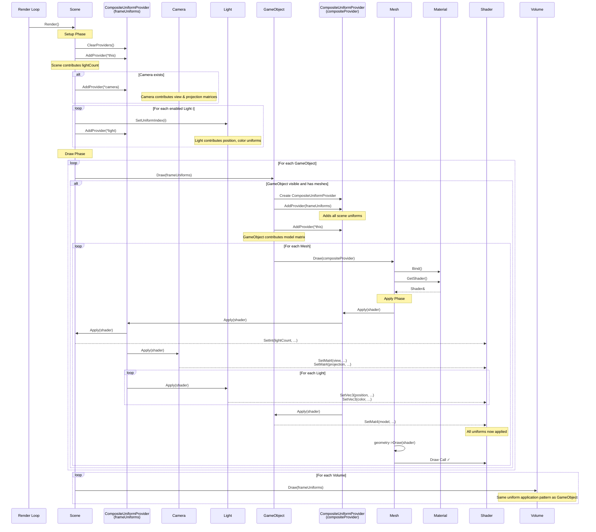

# Uniform Providers Sequence Diagram

This diagram illustrates the flow of uniform providers and uniform application during a scene render before draw calls.

## Sequence: Frame Rendering with Uniform Providers

## Component Roles

### Scene (UniformProvider)
- **Role**: Frame-level uniform aggregator and provider
- **Contributes**: 
  - `lightCount`: Number of active lights
- **Holds**: `frameUniforms` (CompositeUniformProvider)

### CompositeUniformProvider (at frame level)
- **Role**: Aggregates multiple uniform providers for the frame
- **Members**:
  - Scene (light count)
  - Camera (view, projection matrices)
  - Multiple Lights (light properties by index)
- **Responsibility**: Iterate providers and call Apply() on each

### Camera (UniformProvider)
- **Role**: Provides view and projection matrices
- **Contributes**: 
  - `view`: View matrix
  - `projection`: Projection matrix

### Light (UniformProvider)
- **Role**: Provides light-indexed uniforms
- **Contributes** (per light index i):
  - `lights[i].position`, `lights[i].color`, `lights[i].intensity`, etc.

### GameObject (UniformProvider, IDrawable)
- **Role**: 
  - Receives frame uniforms
  - Composes own model-specific uniforms
  - Passes combined uniforms to meshes
- **Contributes**:
  - `model`: Model transformation matrix
- **Creates**: Local CompositeUniformProvider combining frame + self

### Mesh (Drawable unit)
- **Role**: Final uniform applicator before geometry draw
- **Steps**:
  1. Bind material (sets shader)
  2. Call `uniformProvider.Apply(shader)`
  3. Draw geometry with shader

### Shader (Uniform sink)
- **Role**: Receives individual uniform values via Apply()
- **Methods called**:
  - `SetBool()`, `SetInt()`, `SetFloat()`, `SetVec3()`, `SetMat4()`
- **Precondition**: `HasUniform(name)` check before setting

## TypedUniformProvider Detail

When `TypedUniformProvider::Apply()` is called:
1. Iterates over stored `std::map<std::string, UniformValue>`
2. For each uniform:
   - Checks if shader has the uniform with `HasUniform(name)`
   - Uses `std::visit()` to dispatch on variant type
   - Calls appropriate shader method: `SetBool()`, `SetInt()`, `SetFloat()`, `SetVec3()`, `SetMat4()`

## Key Patterns

### Composite Pattern (Decorator-like)
- `CompositeUniformProvider` aggregates multiple providers
- Calling `Apply()` delegates to all member providers
- Enables flexible combination of uniform sources

### Chain of Responsibility
- Uniforms flow through: Scene → GameObject → Mesh → Shader
- Each level can add/override uniforms
- Shader is the final consumer

### Double Dispatch (via std::visit)
- `TypedUniformProvider::Apply()` uses visitor pattern
- Handles polymorphic variant types without runtime type checking
- Type-safe uniform dispatch to shader methods

## Visibility & Filtering

- **GameObject visibility**: Scene checks `gameObject->visible` before drawing
- **Light filtering**: Only enabled lights are added to `frameUniforms`
- **Uniform existence**: Shader checks `HasUniform()` before setting to avoid errors
