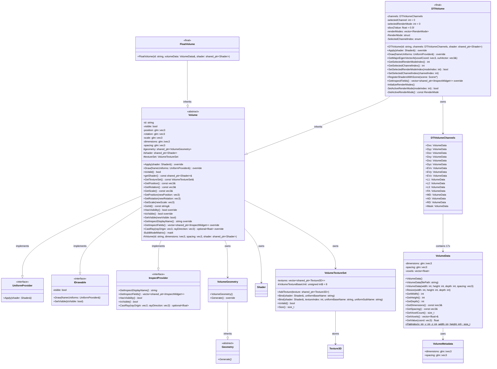

# Volume Class Hierarchy Diagram

## Complete Inheritance Structure



---

## Class Details

### **Volume (Abstract Base Class)**
- **Purpose**: Base class for all volume renderers in the scene
- **Responsibilities**:
  - Manages volume transform (position, rotation, scale)
  - Owns volume geometry and shader
  - Provides uniform application and draw calls
  - Manages texture bindings through VolumeTextureSet
  
- **Key Properties**:
  - `id`: Unique identifier
  - `visible`: Visibility toggle
  - `dimensions`, `spacing`: Volume grid properties
  - `geometry`: VolumeGeometry instance (cube)
  - `shader`: Active shader for rendering
  - `textureSet`: 3D textures bound to shader

- **Protected Constructor**: Only subclasses can instantiate (enforces proper initialization)

### **FloatVolume (Concrete Class)**
- **Purpose**: Simple scalar volume renderer
- **Use Case**: Single-channel volumetric data (e.g., density, intensity maps)
- **Data**: One VolumeData containing float voxels
- **Inheritance**: Minimal; inherits all base Volume functionality

### **DTIVolume (Concrete Class)**
- **Purpose**: Specialized renderer for DTI (Diffusion Tensor Imaging) data
- **Data**: 17 separate VolumeData channels:
  - **6 tensor components**: Dxx, Dyy, Dzz, Dxy, Dxz, Dyz
  - **3 eigenvector components**: EVx, EVy, EVz
  - **3 eigenvalues**: L1, L2, L3
  - **4 scalar metrics**: FA, MD, AD, RD
  - **1 mask**: Skull extraction mask

- **Key Features**:
  - Multiple render modes (e.g., Z-slicing, MIP, etc.)
  - Channel selection (0-15) for visualization
  - Slice parameter for orthogonal plane rendering
  - Query eigenvector at voxel location
  - Hot-reload shader registration with Scene

- **Render Modes**: Allows different shader programs for different visualization techniques

---

## VolumeData Structure

```
VolumeData
├── Metadata
│   ├── dimensions: ivec3 (width, height, depth)
│   └── spacing: vec3 (physical size of each voxel)
├── Voxels: vector<float>
│   └── Linear storage: [x0y0z0, x1y0z0, ..., xWyHzD]
└── Methods
    ├── Load from file
    ├── Resize grid
    ├── Query single voxel
    └── Calculate flat index from 3D coordinates
```

---

## DTIVolumeChannels Structure

```
DTIVolumeChannels
├── Tensor Components (6)
│   ├── Dxx, Dyy, Dzz (diagonal)
│   └── Dxy, Dxz, Dyz (off-diagonal)
├── Eigensystem (6)
│   ├── EVx, EVy, EVz (principal eigenvector)
│   └── L1, L2, L3 (eigenvalues)
├── Derived Scalars (4)
│   ├── FA (Fractional Anisotropy)
│   ├── MD (Mean Diffusivity)
│   ├── AD (Axial Diffusivity)
│   └── RD (Radial Diffusivity)
└── Mask (1)
    └── Binary skull extraction mask
```

**Total**: 17 channels, each a separate VolumeData instance

---

## Data Flow: Volume Creation

### FloatVolume
```
VolumeData (single scalar)
    ↓
FloatVolume(id, volumeData, shader)
    ├── Set dimension/spacing from volumeData
    ├── Create VolumeGeometry (unit cube)
    ├── Bind volumeData as Texture3D
    └── Store in VolumeTextureSet (1 texture)
```

### DTIVolume
```
DTIVolumeChannels (17 VolumeData instances)
    ↓
DTIVolume(id, channels, shader)
    ├── Set dimension/spacing from channels (e.g., channels.Dxx)
    ├── Create VolumeGeometry (unit cube)
    ├── Bind each channel as Texture3D
    │   ├── volumeTextures[0] = {Dxx, Dyy, Dzz} (RGB)
    │   ├── volumeTextures[1] = {Dxy, Dxz, Dyz} (RGB)
    │   ├── volumeTextures[2] = {EVx, EVy, EVz} (RGB)
    │   ├── volumeTextures[3] = {L1, L2, L3} (RGB)
    │   └── volumeTextures[4] = {FA, MD, AD, RD} (RGBA)
    ├── Store in VolumeTextureSet (5 textures packed)
    └── Initialize render modes (Z-slice, MIP, etc.)
```

---

## Interface Implementations

### UniformProvider
- **Apply(Shader&)**: Binds volume-specific uniforms (dimensions, spacing, slice parameters)

### IDrawable
- **Draw(frameUniforms)**: Renders the volume using geometry and shader

### InspectProvider
- **HasVisibility()**: Returns true (volumes are inspectable)
- **IsVisible()**: Returns current visibility state
- **CastRay()**: For UI picking (ray-volume intersection)
- **GetInspectFields()**: Exposes UI widgets for transform, render mode, channel selection

---

## Key Patterns

### **Template Method Pattern**
- `Volume::Draw()` calls protected methods that subclasses can override
- Default implementation works for FloatVolume
- DTIVolume overrides to handle multiple render modes

### **Uniform Provider Pattern**
- Each volume is a UniformProvider
- Scene passes frameUniforms to volume
- Volume combines frame + self uniforms, passes to shader

### **Protected Constructor**
- Prevents direct Volume instantiation
- Ensures texture setup in derived class constructors

---

## Suggested Extensions

To add a new volume type (e.g., VectorVolume, LabelVolume):

```cpp
class YourVolume final : public Volume {
public:
  explicit YourVolume(const std::string& id,
                      const YourData& data,
                      std::shared_ptr<Shader> shader)
    : Volume(id, data.GetDimensions(), data.GetSpacing(), shader),
      data(data) {
    // Bind your data to VolumeTextureSet
  }

  // Override Draw/Apply if custom rendering needed
  void Draw(const UniformProvider& frameUniforms) const override;
  void Apply(Shader& shader) const override;

private:
  YourData data;
};
```
